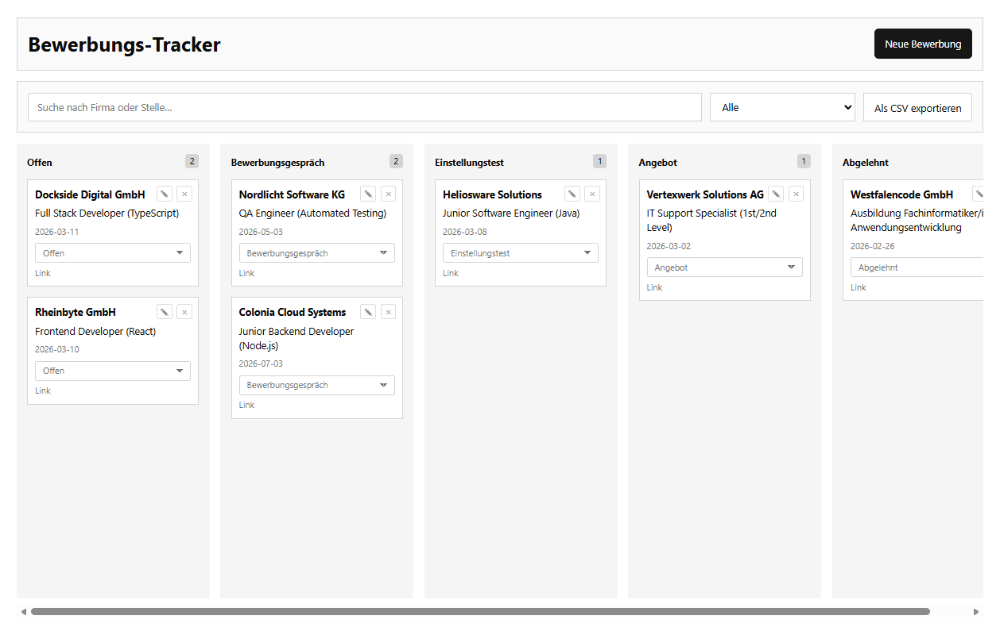

# Bewerbungs-Tracker

Ein einfacher Bewerbungs-Tracker im Kanban-Stil zur Verwaltung von Bewerbungen.

Die Anwendung ermöglicht es, Bewerbungen anzulegen, zu bearbeiten, nach Status zu verwalten, zu filtern und als CSV zu exportieren.  
Die Daten werden lokal im Browser über `localStorage` gespeichert.

## Live-Demo
[Zur Live-Demo](https://demdan01.github.io/bewerbungs-tracker/)

## Vorschau


**Demo-Video:** [Zum Video](assets/demovid.mp4)

---

## Funktionen

- Bewerbungen anlegen
- Bewerbungen bearbeiten
- Bewerbungen löschen
- Status direkt in der Card ändern
- Suche nach Firma oder Rolle
- Status-Filter
- CSV-Export der aktuell sichtbaren Einträge
- Lokale Speicherung im Browser über `localStorage`

### Status-Spalten

- Offen
- Bewerbungsgespräch
- Einstellungstest
- Angebot
- Abgelehnt

---

## Technische Umsetzung

- HTML
- CSS
- JavaScript
- Vite
- GitHub Pages

### Umgesetzte Punkte

- Formular für Erstellen und Bearbeiten über ein gemeinsames Modal
- Zentrale Zustandsverwaltung über ein einfaches `state`-Objekt
- Rendering der Cards pro Status-Spalte
- Event Delegation für Aktionen auf den Cards
- Validierung und Normalisierung von Eingaben
- Persistenz über `localStorage`
- Deployment über GitHub Actions und GitHub Pages

---

## Lokal starten

### Voraussetzungen

- Node.js (empfohlen: aktuelle LTS-Version)
- npm

### Repository klonen

```bash
git clone https://github.com/demdan01/bewerbungs-tracker.git
cd bewerbungs-tracker
```
### Abhängigkeiten installieren
```bash
npm install
```

### Development Server starten
```bash
npm run dev
```
### Production Build lokal testen
```bash
npm run build
npm run preview
```
---

## Hinweise

- Die Anwendung verwendet kein Backend.
- Es gibt keinen Login und keine Datenbank.
- Alle Daten werden ausschließlich lokal im Browser gespeichert.
- Der CSV-Export berücksichtigt die aktuell sichtbaren Einträge, also auch aktive Suche und Filter.

---

## Mögliche Erweiterungen

- Sortierung nach Datum
- Import-Funktion
- Zusätzliche Felder wie Notizen oder Ansprechpartner
- Weitere UI- und Accessibility-Verbesserungen